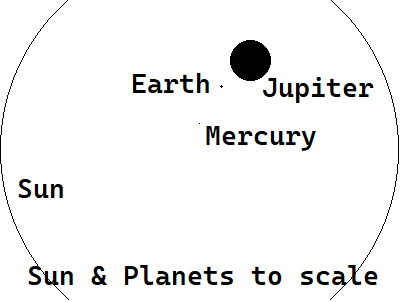
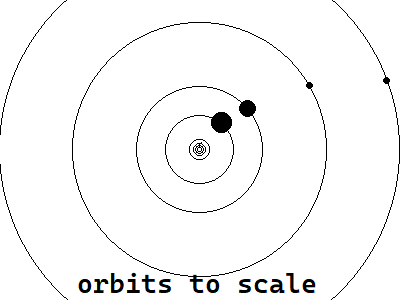

# epaper-orrery

Create an image of our solar system on a [4.2" waveshare e-paper display v2](https://www.waveshare.com/4.2inch-e-paper-module.htm). 

- `build/` objects, executables
- `src/`
  - `epsim.cpp` : Creates PNGs based on data generated
  - `main.cpp` : Entrypoint
  - `ws.cpp` : Interacts with waveshare_lib, scripts that generates shapes 
- `waveshare_lib/` Code written by waveshare that draws shapes 
  - `Config/`
  - `Fonts/`
  - `GUI/`

**Warning!**

According to [waveshare's wiki](https://www.waveshare.com/wiki/4.2inch_e-Paper_Module_Manual#Precautions), you can damage your display *if you leave the display powered on for a long period of time*, or *partially refresh too often* without a full refresh.

## Artistic License

There's no practical way of depicting the solar system to scale on a 400x300 pixel display. Earth has a radius 8.7 % the size of Jupiter, and the Sun is 9.9 larger than Jupiter. If Earth had the radius of 1 pixel, Jupiter would have a radius of 20 pixels and the Sun would have a radius of 200 pixels, which just fits on the full width of the display.

Likewise, the gas giants dominate the width of the display in terms of their orbital radius; Mercury, Venus, Earth and Mars would share a circle with a 10 pixel radius in the center of the screen.

| Planet  | Mean Radius (km) | Fraction of Jupiter | Distance (AU) | Fraction of Neptune’s orbit   
| - | - | - | - | -
| Mercury | 2,440   | .035     | 0.39  | 0.01297      
| Venus   | 6,052   | 0.087    | 0.72  | 0.02395       
| Earth   | 6,371   | 0.091    | 1.00  | 0.03327       
| Mars    | 3,390   | 0.049    | 1.52  | 0.05057       
| Jupiter | 69,911  | 1.000    | 5.20  | 0.1730          
| Saturn  | 58,232  | 0.833    | 9.54  | 0.3174        
| Uranus  | 25,362  | 0.363    | 19.2  | 0.6387        
| Neptune | 24,622  | 0.352    | 30.06 | 1 

So, I completely omit the sun, scale the terrestrial planets up and the gas giants down, while preserving some sense of orbital distance.

## Interface

Connect a microcontroller to the display's carrier board. It uses one way SPI. Image data travels on the SDA/DIN line, with commands over the DC line. For reference:

|Pin    | Desc              |
|-      |-                  |
| RST   | Hardware reset    | 
| DC    | Data/Command line |
| CS    | Chip select       |
| CLK   | Clock             |
| DIN   | *MISO* (master in slave out) aka *SDI* (serial data in).  Connect this to your host's *MOSI* (master out slave in) aka *SDO* (serial data out)     |
| GND   | Ground            |
| VCC   | Power (3.3 or 5v) |

The display expects two black and white images to be written to two different registers each time you'd like to display something- each representing a 4-level grayscale image. Each of the resultant pixel’s grayscale value is formed by combining the corresponding pixels from these two images.